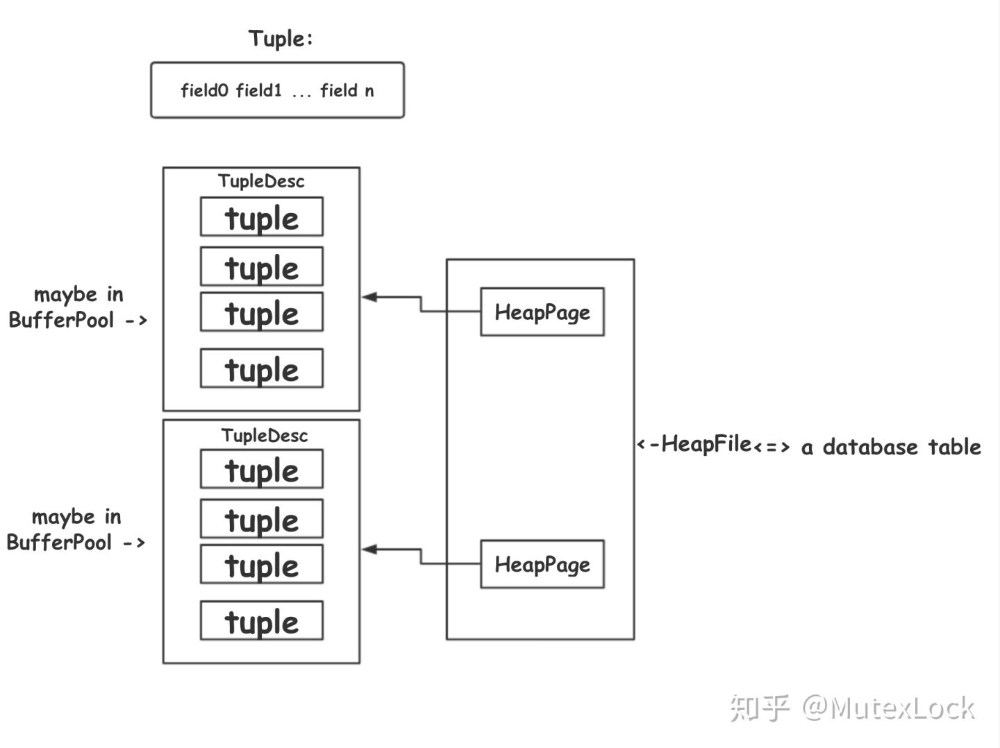

```
tuple: field[1...n]
tupleDesc: (fieldname+fieldtype)[1...n]
page: tuple[1...n], tupledesc
file: page[1...n]
table: page[1...n], file
catalog: (table+schema)[1...n]
```


### TupleDesc: schema of tuple

TDItem: fieldname+fieldtype
- Array of TDItems\<name, type\>


#### Type

String, Int

### Tuple

- TupleDesc
- Array of fields(Store of Data\<Type\>)
- recordid

### Catalog

table<->id<->name
- Map of tables, keys are: name, id(fileid, actually)

- loadSchema
  - read schema from file
  - load tables

#### Table

- DbFile
- PrimaryKey Field
- table name


### BufferPool

Read some page to this pool

- Array of pages(loaded)
- page size is static
  
push new page to the pool, till it is full, throw error


### HeapFile

#### DbFile

Read/Write file -> Heap File/ B+ File

Store some pages

- Share the same tupleDesc(Under one table)

#### HeapFile

  - readPage:
    - BufferPool.read
        - getPage
        - readPage from offset(disk)

- file
- tupleDesc
- iterator

#### HeapPage: create after read from disk

- HeapPageid
  - Tableid
  - pageNumber

- TupleDesc
- headers(mark if this tuple/slot is used)
- tuples: the number of tuples is equal to: `floor((BufferPool.getPageSize()*8) / (tuple size * 8 + 1))`
`+1` is used for the header in page(to mark tuples)

- Recordid : a reference to a specific tuple on a specific page of a specific table.
  - tupleid
  - pageid(tableid, pageNo)

### SeqScan

- iterator to read all tuples from a table(catalog)


Ref: https://zhuanlan.zhihu.com/p/58595037